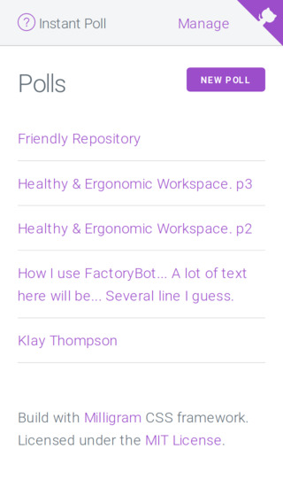
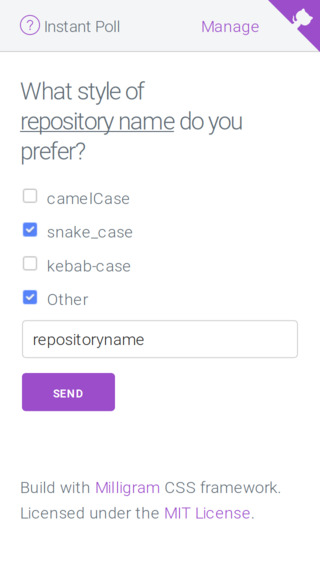
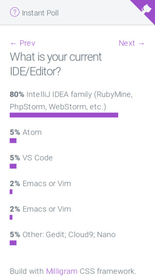
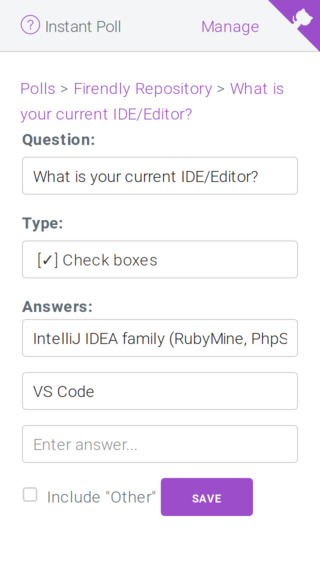

# Instant Poll

> NOTICE: This is a playground project to study Phoenix Channels.

https://instantpoll.gigalixirapp.com/

Polling web app, where admin selects one question, and the audience can see/answer only this specific question.

## Screens









## Deploy

Refer to Gigalixir [documentation](https://gigalixir.readthedocs.io/en/latest/main.html#deploy)

After configure the Gigalixir with repo, just use this command:

```
git push gigalixir master
  - or -
git push gigalixir your_branch:master
```


## Technologies

[Elixir](https://elixir-lang.org/) | [Phoenix](https://phoenixframework.org/) 1.3 | [Gigalixir](https://gigalixir.com/) | [Milligram](https://milligram.io)
